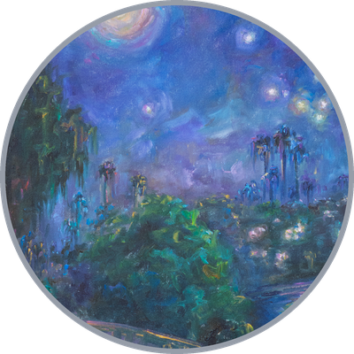
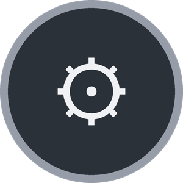
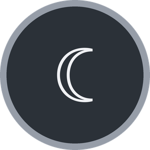

<!-- ─────────────────────────  IG-STYLE PROFILE HEADER  ───────────────────────── -->

### Aneta Kahleová

@anetka_kahle

**Full-stack AI/ML Engineer & Contractor**
 
AI Agents · Context Engineering · LLM · Python · .NET · TypeScript
 
👩‍💻 Model & Entrepreneur ✨

 

*“Translating human chaos into robot instructions.”*

 

<!-- ─────────────────────────  STORY-HIGHLIGHT NAV  ───────────────────────── -->
<table align="center"><tr>
<td align="center" width="120">
  
   <b>What I Do</b>
</td>
<td align="center" width="120">
  
   <b>Projects</b>
</td>
<td align="center" width="120">
  
   <b>Life</b>
</td>
<td align="center" width="120">
  
   <b>Contact</b>
</td>
</tr></table>

<i>↑ tap a bubble to jump · tap a section title to open it</i>

 

---

<!-- ─────────────────────────  WHAT I DO  ───────────────────────── -->

<h3>⚙ &nbsp; What I Do</h3>

 
  <i>I work primarily on enterprise-grade private repositories (ComplianceAI, SQL Agents, Knowledge Bots).</i>
  

**Agent Orchestration**
 Designing autonomous systems where AI agents interact, plan, and execute tasks — built in .NET with **LLMtornado** and graph-based workflows with **LangGraph**.
 

 

**Data Analysis & Automation**
 Automating the boring stuff: **Playwright** for robust web scraping, **Pandas/Spark** to clean, analyze, and visualize large datasets.
 

 

**Context Engineering & Agentic RAG**
 Building precision-focused retrieval pipelines — including **agentic RAG**, where agents reason over, route, and refine retrieval to feed the right data into LLMs. Currently powering a customer-facing chatbot at **OKlab**, launching soon on <a href="https://www.okskoleni.cz/en">okskoleni.cz</a>.
 

 

**Full-stack Engineering**
 Delivering end-to-end solutions in **C#/.NET** combined with **TypeScript/React**.
 

  

<b>Plus the everyday toolbox:</b> 

 

---

<!-- ─────────────────────────  PROJECTS  ───────────────────────── -->

<h3>★ &nbsp; Selected Projects</h3>

 

**<a href="https://hanakahleova.com">hanakahleova.com</a>**
 
With my mum — a physician and **diabetologist** — turning decades of **evidence-based** research on **type 2 diabetes & obesity** into a platform that reaches and helps far more people.

 

**OKlab Knowledge Chatbot**
 
A customer-facing **agentic RAG** chatbot, launching soon on <a href="https://www.okskoleni.cz/en">okskoleni.cz</a>.

 

---

<!-- ─────────────────────────  LIFE  ───────────────────────── -->

<h3>☾ &nbsp; Life</h3>

 
  
   
  <i>Finding calm in the noise.</i>
    

 
<i>Explore my mind</i>

 

---

<!-- ─────────────────────────  CONTACT  ───────────────────────── -->

<h3>✉ &nbsp; Let's Work Together</h3>

 

I work as a <b>contractor</b>, delivering custom software end-to-end.
 
<b>Need something built?</b> Reach me at <code>aneta.kahleova@gmail.com</code>, or find me here:

  

  

🔒 <b>Secure communication (PGP)</b> — for anything sensitive, please encrypt with my key.
 
Fingerprint: <code>79C3 F982 36E3 1062 0CC2 EAFE B728 9F5B D3B1 5218</code>
 

 

---

  A huge thank you to <b>Matěj Štágl</b> — <a href="https://github.com/lofcz">lofcz</a> — for introducing me to the world of programming. Forever grateful.
   
  

