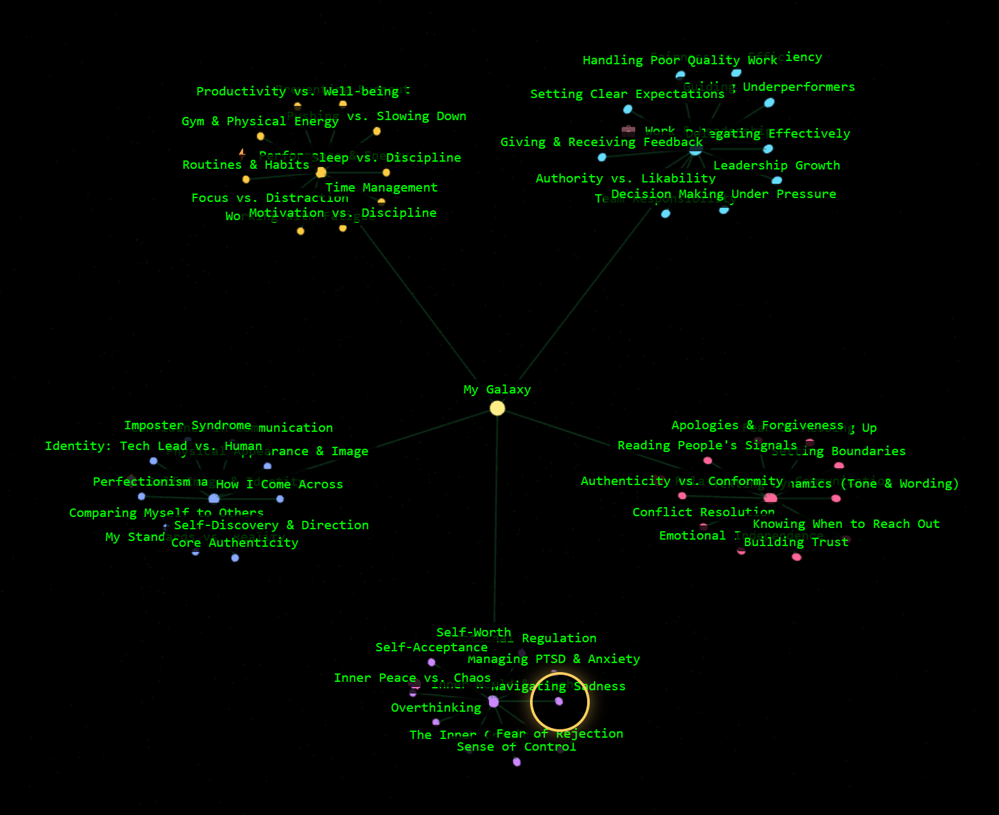

<!-- Header Images - Centered -->

  
  

 

### Translating human chaos into robot instructions. 🪄

<!-- Dynamic Typing Effect -->

 

I am a **Full-stack AI Engineer** and **Data Analyst** with a strong passion for **Automation** and **Agentic Workflows**.

My work bridges the gap between raw data and intelligent decision-making. I specialize in **agent orchestration** and **agentic RAG** — building **autonomous agents** in **.NET** with **LLMtornado** and graph-based workflows with **LangGraph**, and mining data from the web via **Playwright**. I love turning chaotic data into structured insights.

Currently **AI Tech Lead at OKlab** (a division of **OKsystem**), where I built a chatbot launching soon on <a href="https://www.okskoleni.cz/en">okskoleni.cz</a>.

 

---

### 
🚀 What I Do

  <i>I work primarily on enterprise-grade private repositories (ComplianceAI, SQL Agents, Knowledge Bots).</i>

 

⚡ **Agent Orchestration**
 Designing autonomous systems where AI agents interact, plan, and execute tasks — built in .NET with **LLMtornado** and graph-based workflows with **LangGraph**.
 

 

🌱 **Data Analysis & Automation**
 Automating the boring stuff: **Playwright** for robust web scraping, **Pandas/Spark** to clean, analyze, and visualize large datasets.
 

 

🔭 **Context Engineering & Agentic RAG**
 Building precision-focused retrieval pipelines — including **agentic RAG**, where agents reason over, route, and refine retrieval to feed the right data into LLMs. Currently powering a customer-facing chatbot at **OKlab**, launching soon on <a href="https://www.okskoleni.cz/en">okskoleni.cz</a>.
 

 

✨ **Full-stack Engineering**
 Delivering end-to-end solutions in **C#/.NET** combined with **TypeScript/React**.
 

 

  <b>Plus the everyday toolbox:</b> 
  
  
  
  

 

---

### 
💚 A Project Close to My Heart

Together with my mum — a physician and **diabetologist** — I'm building <a href="https://hanakahleova.com">hanakahleova.com</a>.

For many years she has researched how **nutrition** can help treat **type 2 diabetes and obesity**, with a long list of scientific publications behind her. Her mission is to find **evidence-based** ways to eat better and help people live healthier lives.

I decided to help her **extend that reach** — turning decades of research into something that can reach, and help, far more people.

 

---

### 
🌌 The Human Behind the Code

  
   
  <i>Finding calm in the noise.</i>

This is my professional side. Beyond the code, I live for **art**, **movement**, **nature**, and a lot of **inner exploration**.

I mapped it all into an **interactive galaxy** — every star is a piece of who I am. Wander through it. 🪐

 

 
<i>👆 Step into my galaxy</i>

---

### 
🤝 Let's Work Together

I work as a <b>contractor</b>, delivering custom software end-to-end — the project above is one example.
 
<b>Need something built?</b> I'm open to collaboration. Reach out at <code>aneta.kahleova@gmail.com</code>, or find me here:

  

  

🔒 Secure communication (PGP)

 
For anything sensitive, please encrypt it with my PGP key.
  
<small>Fingerprint: <code>79C3 F982 36E3 1062 0CC2 EAFE B728 9F5B D3B1 5218</code></small>
  

 

---

  ✨ A huge thank you to <b>Matěj Štágl</b> — <a href="https://github.com/lofcz">lofcz</a> — for introducing me to the world of programming. Forever grateful! 🦁
   
  

